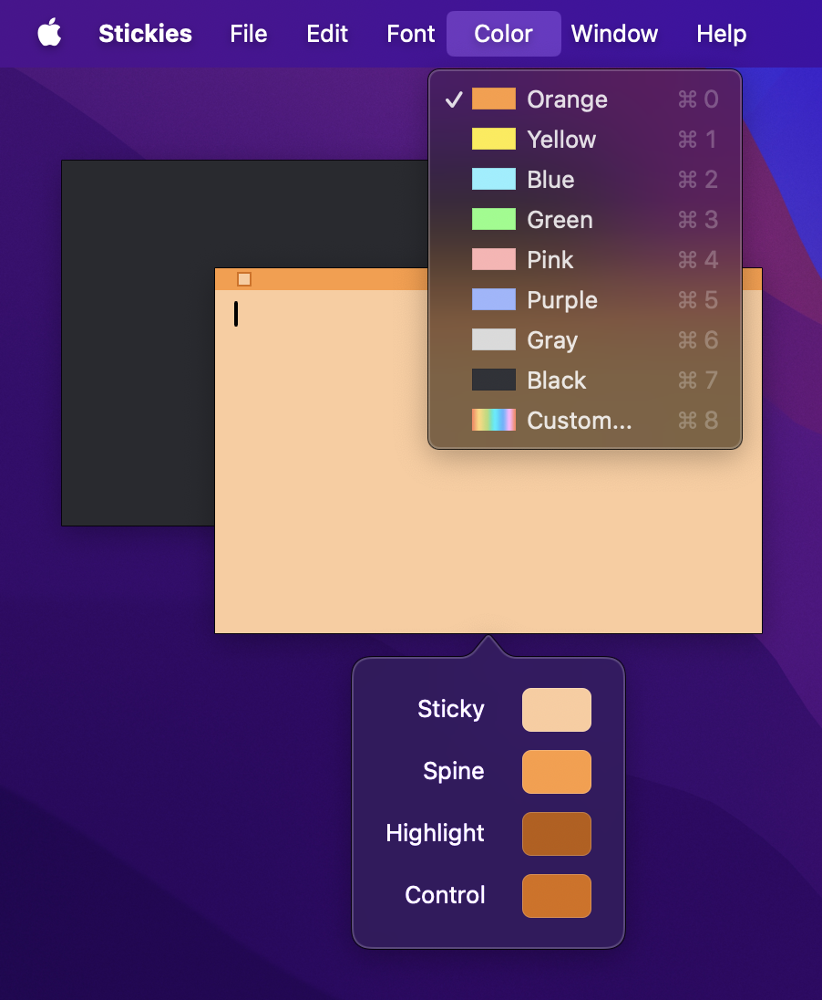

# StickerColorPicker

# Information:

- StickerColorPicker is a MacForge (SIMBL) plugin for Stickies that adds black, orange, and custom color options to the Colors menu
- Tested on Apple silicon macOS 14.1 (Stickies 10.2)
- Authored by [shishkabibal](https://github.com/shishkabibal)

# Installation:

1. Download [MacForge Apple silicon beta](https://github.com/jslegendre/appcast/raw/master/Beta/MacForge/MacForge.1.2.2-2.zip)
2. Download [StickerColorPicker](https://github.com/shishkabibal/StickerColorPicker/releases/latest)
3. Unzip both downloads
4. Open `StickerColorPicker.bundle` with `MacForge.app`
5. Restart Stickies to load StickerColorPicker

### Appeal:
Repurpose the code any way you like, but please don't just repackage it with your name. Remember to be nice to other people. If you make any changes and want to contribute, feel free to make a pull request.
